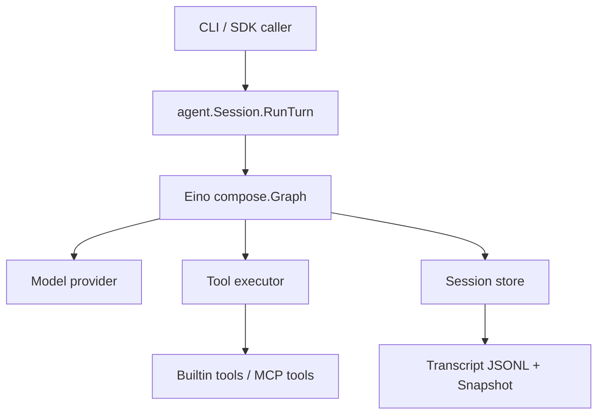

# claude-code-go

[](https://go.dev/)
[](./LICENSE)
[](https://github.com/daewoochen/claude-code-go/stargazers)

**A terminal-native coding agent runtime in Go, powered by Eino.**

`claude-code-go` is an opinionated Go implementation of the core runtime ideas behind modern coding agents:

- multi-turn agent loops
- structured tool calling
- streaming events
- local input preprocessing and slash commands
- resumable sessions
- prompt-too-long and max-output recovery
- checkpoint-ready execution graphs
- real stdio MCP tool registration

It is designed for people who want the **Claude Code style architecture** in a **Go-first, hackable, open-source codebase**.

## Why This Repo Is Worth Starring

- **One of the clearest Go codebases for building a real coding agent**
- **Graph-based runtime, not a toy wrapper around an API call**
- **Session persistence, tool loops, permission policy, and MCP transport included**
- **Small enough to understand, serious enough to extend**

If you want to build your own terminal agent, internal engineering copilot, or remote coding worker in Go, this repo is meant to save you weeks.

## Demo

### Plain CLI mode

```bash
$ go run ./cmd/ccgo run --provider mock "hello from ccgo"
[system] calling model
mock: hello from ccgo
```

### Stream JSON mode

```bash
$ go run ./cmd/ccgo print --provider mock "use echo from stream mode"
{"type":"system","message":"calling model", ...}
{"type":"tool_result","tool_name":"echo", ...}
{"type":"assistant_delta","delta":"Tool echo returned: ...", ...}
{"type":"result","reason":"completed", ...}
```

## Feature Snapshot

| Capability | Status |
| --- | --- |
| Go-native CLI runtime | Yes |
| Eino graph orchestration | Yes |
| Multi-turn agent loop | Yes |
| Local input preprocessing (`/tools`, `/session`, `!cmd`) | Yes |
| Tool registry + permission policy | Yes |
| Session transcript + snapshot resume | Yes |
| Prompt-too-long recovery | Yes |
| Max-output auto-continue | Yes |
| Anthropic-compatible provider | Yes |
| Real Anthropic SSE text streaming | Yes |
| Full stdio MCP protocol client | Yes |
| MCP static tool bridge | Yes |
| TUI shell | Not yet |

## Why This Exists

Most coding agents today are either:

- tied to a closed-source product
- deeply coupled to a frontend shell
- hard to embed into your own CLI, platform, or internal developer workflow

`claude-code-go` takes the opposite approach:

- **runtime first**: the event model and agent loop come before UI
- **Go first**: easy to embed in backend services, CLIs, daemons, and internal platforms
- **Eino native**: graphs, checkpoints, interrupts, and orchestration come from a modern Go agent framework
- **open by default**: built to be forked, audited, customized, and shipped

## What You Get Today

- `ccgo run` for regular CLI execution
- `ccgo print` for stream-json event output
- `ccgo resume` for resumable sessions
- `ccgo sessions list` for session discovery
- `ccgo mcp check` for MCP config validation
- local pre-model shortcuts:
  - `/tools`
  - `/session`
  - `/clear`
  - `/model <name>`
  - `/permission <mode>`
  - `!<bash command>`
- a graph-based agent loop with these stages:

```text
InputNormalize
-> SystemPromptAssemble
-> MessageRewrite
-> ModelCall
-> ToolDispatch
-> AttachmentMemoryInject
-> StopBudgetCheck
-> ContinueOrFinish
```

- builtin tools:
  - `echo`
  - `read_file`
  - `bash`
- Anthropic-compatible messages API provider with SSE text streaming
- append-only transcript + snapshot persistence
- permission policy layer with `allow_all`, `deny_all`, `ask_as_error`
- reactive prompt-too-long compaction
- automatic continuation on max-output stop reasons
- stdio MCP tool discovery and tool invocation

## Quickstart

### 1. Install

```bash
git clone https://github.com/daewoochen/claude-code-go.git
cd claude-code-go
go test ./...
```

### 2. Run with the mock provider

This works without any API key and is great for understanding the runtime flow.

```bash
go run ./cmd/ccgo run --provider mock "hello from ccgo"
```

### 3. See structured stream output

```bash
go run ./cmd/ccgo print --provider mock "use echo from stream mode"
```

### 4. Try local runtime commands

```bash
go run ./cmd/ccgo run --provider mock "/tools"
go run ./cmd/ccgo run --provider mock --permission-mode allow_all "!pwd"
```

### 5. Run with Anthropic

```bash
export ANTHROPIC_API_KEY=your_key_here
go run ./cmd/ccgo run --provider anthropic --model claude-3-5-sonnet-latest "summarize this repository"
```

## Example Commands

```bash
go run ./cmd/ccgo run --provider mock "read README.md"
go run ./cmd/ccgo run --provider mock "run pwd"
go run ./cmd/ccgo sessions list
go run ./cmd/ccgo resume --session-id <session_id> "continue from the last step"
go run ./cmd/ccgo mcp check --mcp-config ./examples/mcp.example.json
```

## Architecture



More detail lives in [docs/ARCHITECTURE.md](./docs/ARCHITECTURE.md).

## MCP

This repo already includes:

- MCP config loading
- MCP config validation
- stdio MCP client bootstrapping
- dynamic MCP tool discovery via `tools/list`
- MCP tool invocation via `tools/call`
- a static MCP tool bridge for local development and testing

Sample configs are available at [examples/mcp.example.json](./examples/mcp.example.json) and [examples/mcp.stdio.example.json](./examples/mcp.stdio.example.json).

## Roadmap

- SSE tool-use streaming and earlier tool dispatch
- richer context compression and token-budget recovery
- tool interrupt / resume semantics mapped to Eino checkpoints
- richer MCP transports beyond stdio
- OpenAI-compatible provider
- TUI shell on top of the current runtime
- remote worker / daemon mode

## Philosophy

This project is not trying to be a line-by-line port of any proprietary codebase.

It is a **clean, Go-native reimplementation of the runtime patterns** that make terminal coding agents powerful:

- evented execution
- deterministic tool boundaries
- resumable sessions
- extensible tool registries
- model-agnostic orchestration

## Project Status

`claude-code-go` is currently **early but real**:

- the architecture is in place
- the CLI works
- the tests pass
- the repository is intentionally small enough to understand in one sitting

That makes it a strong foundation for:

- self-hosted coding agents
- internal engineering copilots
- remote task runners
- experimentation with Go-native agent runtimes

## Important Note

`claude-code-go` is an independent open-source project and is **not affiliated with Anthropic**.

It is inspired by the product direction of terminal coding agents, but the Go runtime in this repository is implemented independently and intended for educational, experimental, and product-building use.

## Contributing

Issues and PRs are welcome.

The highest leverage contributions right now are:

- provider integrations
- MCP transport support
- session compatibility tooling
- better context compression
- benchmark and eval harnesses

## License

MIT
