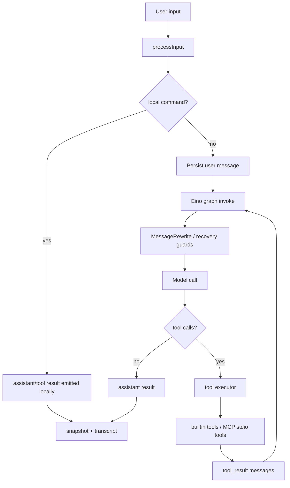

# Architecture

## Overview

`claude-code-go` is organized around one central abstraction:

- `Session.RunTurn(ctx, input)` produces a stream of runtime events while mutating a resumable session state.

The implementation splits into five layers:

1. `cmd/ccgo`
2. `internal/cli`
3. `internal/agent`
4. `internal/tools` + `internal/providers` + `internal/mcp`
5. `internal/session`

## Main Flow



## State Model

The canonical state is `runtime.SessionState`.

It carries:

- messages
- usage
- budget
- permission mode and denials
- pending tool calls
- checkpoint id
- model metadata
- interrupt and resume metadata
- reactive compaction counters
- max-output recovery counters

This keeps the CLI, storage layer, and graph nodes aligned on one source of truth.

## Agent Graph

The current graph is intentionally explicit.

```text
InputNormalize
-> SystemPromptAssemble
-> MessageRewrite
-> ModelCall
-> ToolDispatch
-> AttachmentMemoryInject
-> StopBudgetCheck
-> ContinueOrFinish
```

That shape is close to how production coding agents behave, but small enough to extend without fear.

## Tool Layer

Tools are defined by:

- descriptor
- interrupt behavior
- permission decision
- execute function

The executor supports:

- serial execution for side-effecting tools
- batch concurrency for concurrency-safe tools
- permission denial reporting
- progress events
- MCP stdio tools loaded dynamically from `tools/list`

For MCP servers, `internal/mcp` converts a remote tool into a normal runtime tool definition. That keeps the model/provider layer unaware of whether a tool is builtin or remotely sourced.

## Persistence

Persistence is intentionally simple and debuggable:

- transcript: append-only JSONL
- snapshot: latest materialized session state
- metadata: session index for `sessions list`

This makes it easy to inspect and migrate by hand.

## Design Direction

The runtime is optimized for:

- embedability
- resumability
- testability
- explicit tool boundaries
- provider portability

The next major upgrades are SSE tool-use streaming with earlier dispatch, richer MCP transports beyond stdio, and deeper checkpoint-driven interruption semantics.
